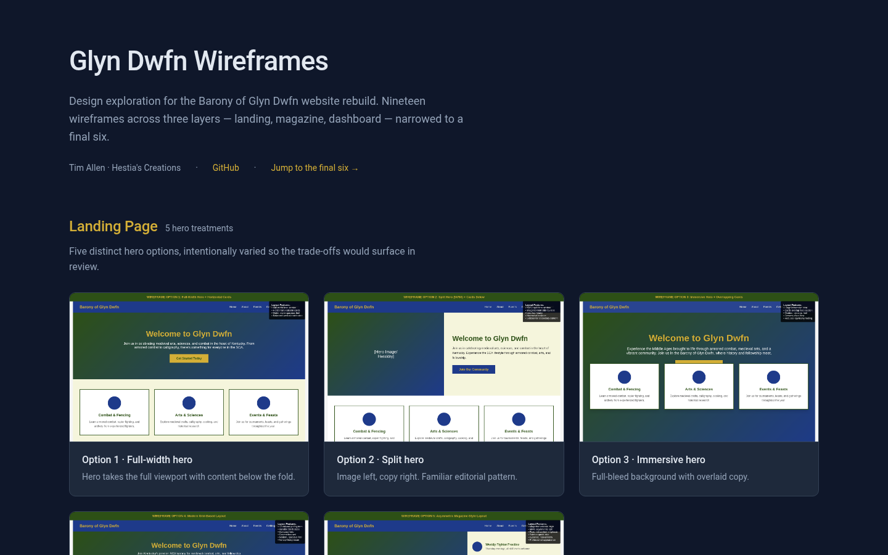

# Glyn Dwfn Wireframes

Design exploration for the Barony of Glyn Dwfn website rebuild. Nineteen wireframes across three layers — landing, magazine, dashboard — narrowed to a final six.

## Browse the gallery

Open [`index.html`](index.html) for the polished gallery view (screenshots, sections, captions, links to each wireframe). Once GitHub Pages is enabled the live URL is `https://helo3301.github.io/glyndwfn-wireframes/`.

Or jump directly:

- [Final six](final-3-index.html) — the curated end-state
- [Landing-page options nav](landing-options.html) — the original 5-hero options hub
- [Magazine variants nav](magazine-index.html)
- [Dashboard variants nav](dashboard-index.html)

## What's in the repo

**Landing-page options** — five distinct hero treatments, intentionally varied so trade-offs would surface in review.

| File | Treatment |
|---|---|
| `option1-fullwidth-hero.html` | Hero takes full viewport, content below the fold |
| `option2-split-hero.html` | Image left, copy right; familiar editorial pattern |
| `option3-immersive-hero.html` | Full-bleed background with overlaid copy |
| `option4-grid-layout.html` | No hero — immediate grid of entry points |
| `option5-magazine-layout.html` | Editorial framing with featured story up top |

**Magazine layouts** — eight iterations on the news / officers / events section. v1–v5 are early divergent options; v6–v8 were carried into final review.

| File | Direction |
|---|---|
| `magazine-v1-calendar.html` | Calendar-led |
| `magazine-v2-carousel.html` | Carousel of featured stories |
| `magazine-v3-gallery.html` | Image-forward grid |
| `magazine-v4-officers.html` | Officers directory first |
| `magazine-v5-news.html` | News feed dominant |
| `magazine-v6-hybrid.html` | **Final** — calendar + news + officers share the front page |
| `magazine-v7-timeline.html` | **Final** — chronological feed |
| `magazine-v8-dashboard.html` | **Final** — activity-dashboard with quick-access tiles |

**Dashboard layouts** — three iterations on the logged-in member dashboard. All three carried into final review.

| File | Approach |
|---|---|
| `dashboard-v9-calendar-focus.html` | Member's upcoming events take primary real estate |
| `dashboard-v10-event-cards.html` | Card-based event browsing with rich preview |
| `dashboard-v11-sidebar.html` | Persistent navigation with content panel on the right |

**The final six** — `final-3-index.html` collects the curated end-state: the three dashboards (v9, v10, v11) and the three magazine layouts (v6, v7, v8).

## Design constraints

- **Audience**: SCA barony members — broad age range, mixed device fluency, mobile-heavy traffic
- **Brief**: replace an aging static site with something that surfaces the calendar, current officers, and event chronicles without burying any of them
- **Constraint**: HTML/CSS only at the wireframe stage — no framework lock-in until the design was settled

## Status

Wireframes complete. Implementation lives in a separate (private) repo where the final direction is being built into the production site. This repo is preserved as the design archive: the iteration trail, not the shipped output.

## License

See [LICENSE](LICENSE) if present, otherwise: design work © Tim Allen, all rights reserved.
